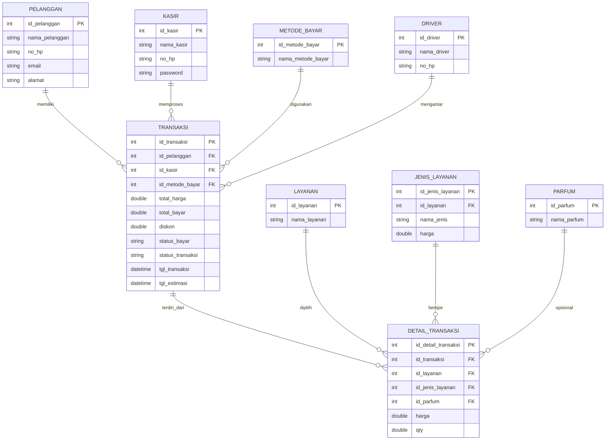

# ERD Kasmini Laundry

Dokumen ini menjadi bukti rancangan basis data untuk aplikasi Kasmini Laundry.

Catatan:
- Diagram ini disusun mengikuti model dan relasi yang ada di codebase Laravel.
- Fokus utama ERD adalah alur transaksi, pelanggan, kasir, layanan, dan pembayaran.
