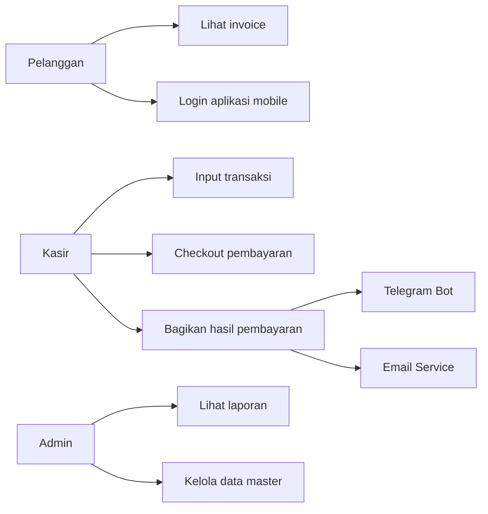
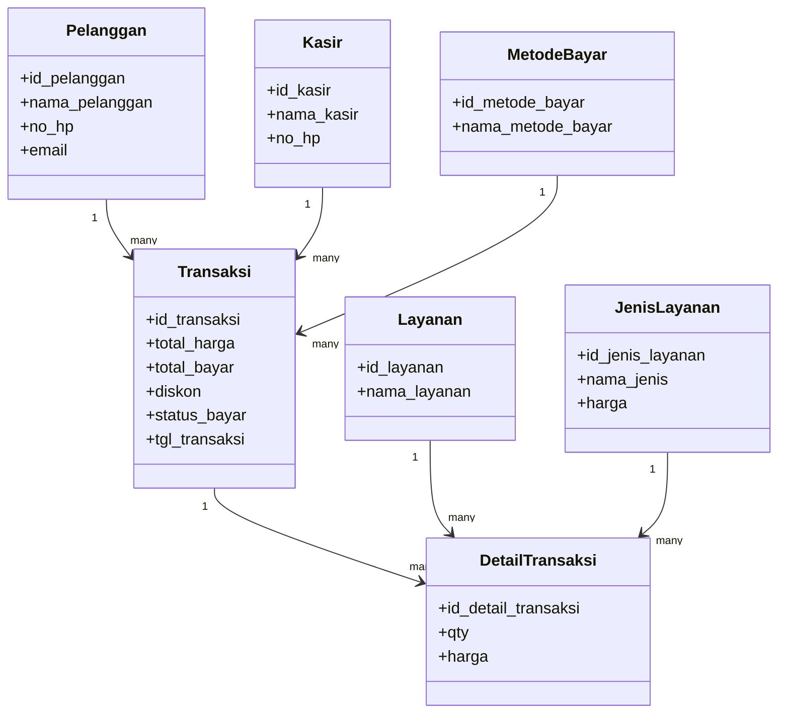

# UML Kasmini Laundry

## Use Case Diagram

## Class Diagram

Catatan:
- Use case menekankan pembagian jobdesc pelanggan, kasir, dan admin.
- Class diagram mengikuti model utama yang dipakai oleh sistem transaksi laundry.
